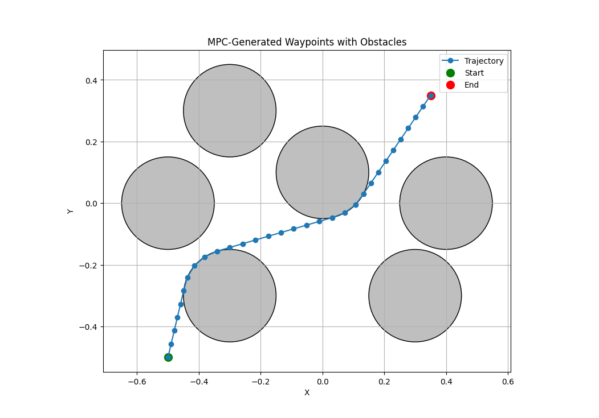

# robosuite_MPC_obstacle_avoiding

This project implements Model Predictive Control (MPC) for obstacle avoidance in robotic manipulation using the robosuite 1.5 environment. The system consists of three main components:

1. **Waypoint Generation**: Using MPC to generate collision-free trajectories between start and end points while avoiding obstacles. The waypoints are saved to `mpc_trajectory.csv`.

The above figure shows an example trajectory generated by the MPC algorithm, where:
- Green dot: Starting position
- Red dot: Target position
- Grey circles: Obstacles
- Blue line with markers: Generated collision-free trajectory

2. **Trajectory Following**: A robot arm controller that reads the generated waypoints and executes the trajectory.

The above animation shows the UR5e robot arm following the MPC-generated trajectory while avoiding obstacles in real-time.

3. **Environment Customization**: The ability to modify obstacle positions by replacing the `stack.py` file in the robosuite site package.

The project demonstrates real-time obstacle avoidance for robotic manipulation tasks using optimization-based trajectory planning.
